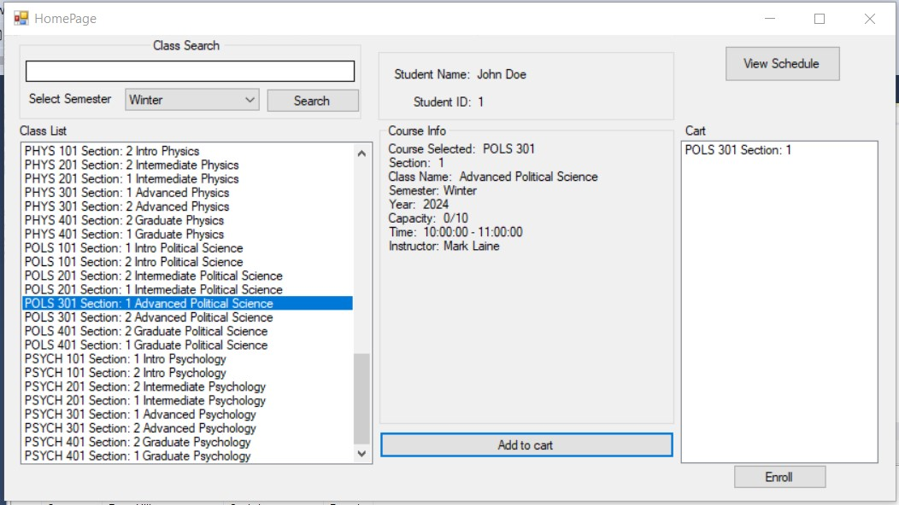
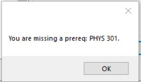
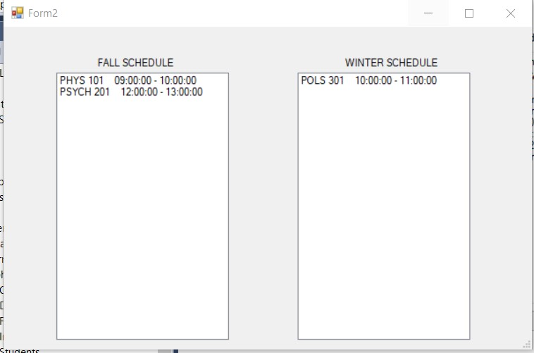
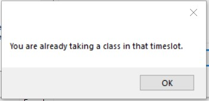
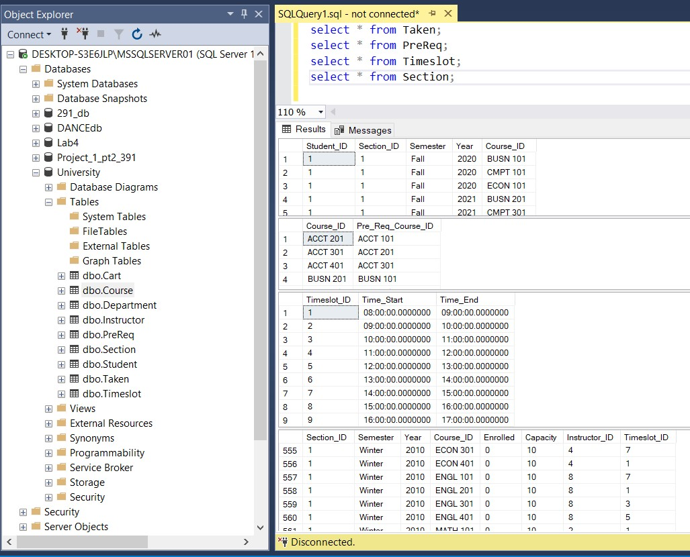

🎓 School Scheduling App – University Registration System

Highly optimized, database-driven university course registration system built in C# with SQL Server for backend data management.

  

📚 About the Project

This application simulates a university registration system where students can search, select, and enroll in classes. It was developed to showcase SQL optimization techniques and database design principles while using C# for a sleek desktop UI and Microsoft SQL Server for handling backend data. The focus of the project is on:

Optimized SQL queries for efficient data retrieval and integrity.

Database transactions to ensure secure enrollment.

Error handling for prerequisites, class availability, and schedule conflicts.

✨ Features

- Class Search: Efficient querying with filtering options (semester, year, capacity).

- Prerequisite Validation: Real-time checks for required courses before adding to the cart.

- Schedule Conflict Detection: Optimized query logic to ensure no class time overlaps in the student’s cart.

- Secure Enrollment: Transactions ensure data integrity, and prevent partial enrollments.

- Real-time Updates: Dynamic database interactions for live enrollment and course status updates.

- Optimized Database: Materialized views, indexed queries, and smart joins for speed and efficiency.

🛠️Technologies & Tools

Backend: C# (for application logic, UI interaction)

Database: Microsoft SQL Server (for managing courses, students, and enrollments)

IDE: Visual Studio (for development and testing)

Database Optimization:

Materialized Views for optimized query performance

Indexed Queries for fast lookup of student course enrollments

Transactions to ensure consistent, secure data changes

⚙️ How It Works

Class Search:
SQL query retrieves course data, filtering based on year, semester, and capacity.

Prerequisite Validation:
Query the Prereq table for any prerequisites.
Check the student's course history to ensure they’ve completed the prerequisite courses.

Schedule Conflict Check:
Classes selected are compared with the student’s existing schedule using the Cart table.
A conflict is detected by checking the start and end times of classes.

Enrollment:
A transaction enrolls the student into all courses in their cart, ensuring that class capacity is checked and updated in real-time.
Upon successful enrollment, the isEnrolled flag is updated for each course, and capacity is incremented.

🖼️ Screenshots

  
 *No prereq met* 
  
 *Schedule view*

  
 *Schedule Conflict*

  
 *Schema and database info*
